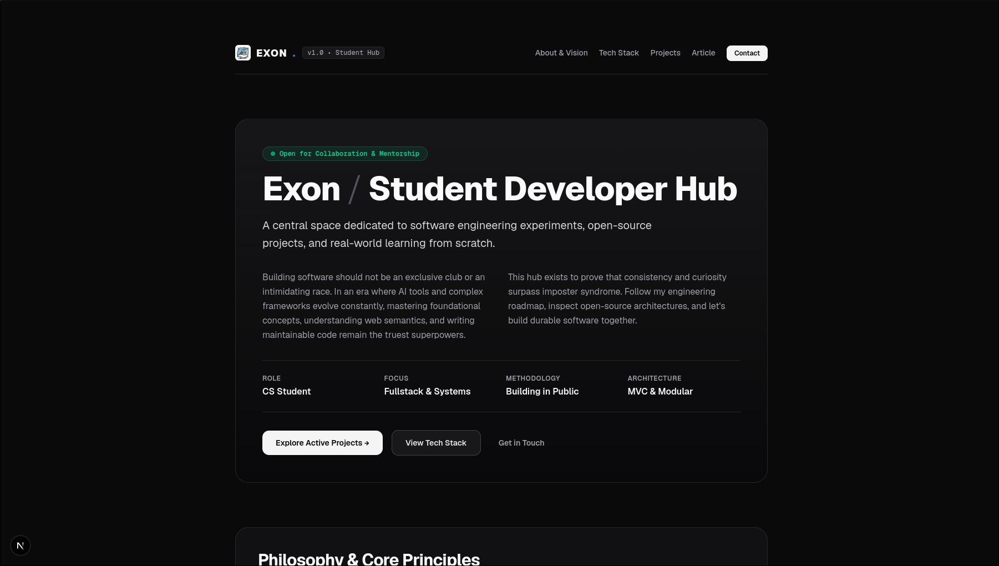

# Exon - Student Developer & Community Hub

Official web platform and community hub for Exon, designed for YouTube followers, student developers, and open-source collaborators.

🌐 **Live Website:** [https://exon-ten.vercel.app/](https://exon-ten.vercel.app/)

<div align="left">

[](https://exon-ten.vercel.app/)
[](https://github.com/Exoncode-stream/Exon)

</div>



---

## Overview

This repository hosts the source code for the Exon Community Hub. It serves as a central reference platform to share software engineering experiments, track learning progression, break down imposter syndrome for self-taught developers, and showcase clean, modular front-end architecture.

---

## Key Technical Decisions & Architecture

- **Strict Semantic HTML5:** Built entirely without generic container elements (`div` or `span`). Uses native landmarks (`header`, `nav`, `main`, `section`, `article`, `dl`, `address`, `kbd`, `time`) to guarantee a clean accessibility tree.
- **Native Accessibility (WAI-ARIA):** Direct section bindings via `aria-labelledby`, landmark navigation, and keyboard-friendly focus management.
- **Performance & Modern Rendering:** Developed with Next.js App Router (React 19) for static pre-rendering, optimal SEO indexing, and minimal client runtime overhead.
- **Micro-Interactions & Fluid Animations:** Lightweight CSS animations (`fadeInUp`, `pulseGlow`) with automatic `prefers-reduced-motion` detection.
- **Design System:** Utility-first styling with Tailwind CSS v4 and a dark-first developer aesthetic.

---

## Included Sections & Features

1. **Global Header & Navigation:** Custom SVG branding, version indicator, and section quick-links.
2. **Hero & Positioning:** Mission statement, core philosophy, and high-level role metrics description list.
3. **Core Philosophy:** Three engineering tenets (*Semantic & Accessible*, *Fundamentals First*, *Open & Collaborative*).
4. **Tech Stack Matrix:** Categorized overview of frontend, backend, and DevOps tooling.
5. **Active Project Card:** Status and repository link for the core Exon Community Hub (Base MVC phase).
6. **Deep-Dive Technical Article:** Detailed breakdown titled *"Why Semantic HTML5 Outperforms Traditional Generic Markup"* (Published on August 21, 2026).
7. **Semantic Contact Channels:** Structured direct links to Discord (`guiireg`), GitHub (`@guiiireg`), and Email (`exon.code@proton.me`).

---

## Tech Stack

- **Framework:** [Next.js](https://nextjs.org/) (App Router, React 19)
- **Language:** [TypeScript](https://www.typescriptlang.org/)
- **Styling:** [Tailwind CSS v4](https://tailwindcss.com/)
- **Bundler & Tooling:** Turbopack, ESLint

---

## Getting Started

### Prerequisites

- Node.js `>= 20.x`
- npm (or pnpm / yarn / bun)

### Installation

1. Clone the repository:
   ```bash
   git clone https://github.com/Exoncode-stream/Exon.git
   cd Exon
   ```

2. Install dependencies:
   ```bash
   npm install
   ```

3. Run the local development server:
   ```bash
   npm run dev
   ```

4. Open [http://localhost:3000](http://localhost:3000) in your browser.

---

## Build & Production

To create an optimized production build:

```bash
npm run build
npm run start
```

---

## Author & Community

- **Creator:** Exon ([@guiiireg](https://github.com/guiiireg))
- **Email:** [exon.code@proton.me](mailto:exon.code@proton.me)
- **Discord:** `guiireg`
- **Purpose:** Personal project hub maintained exclusively for Exon's community and audience.

