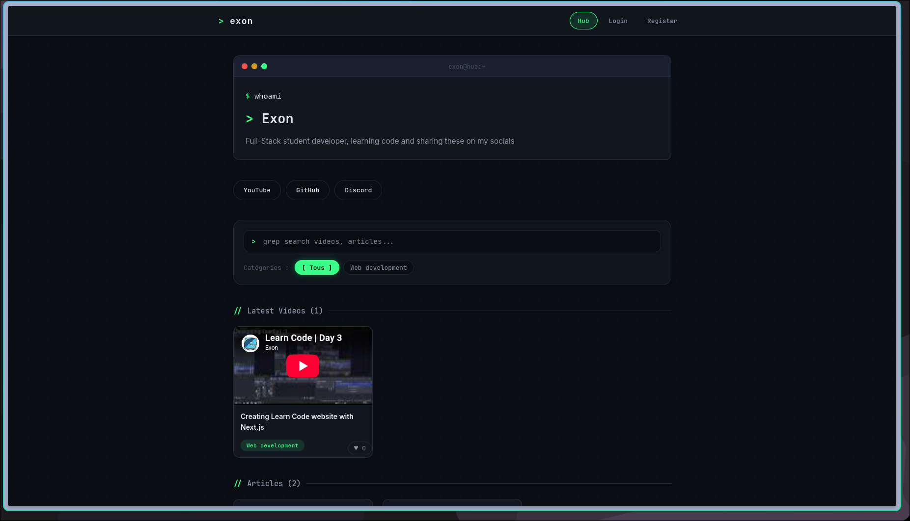
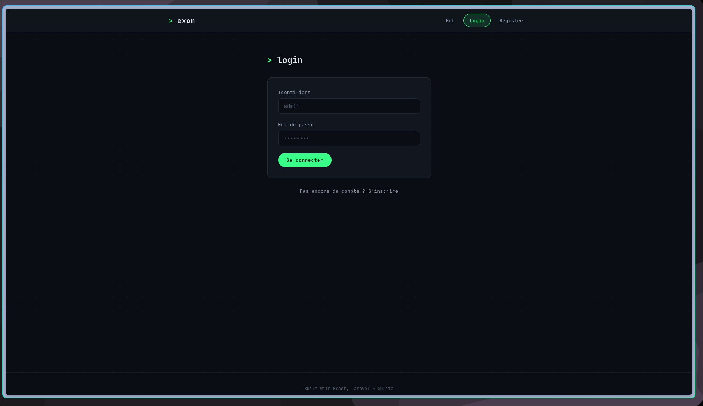
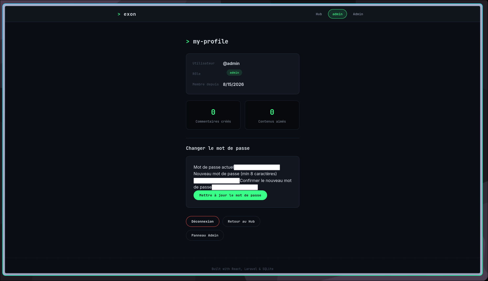
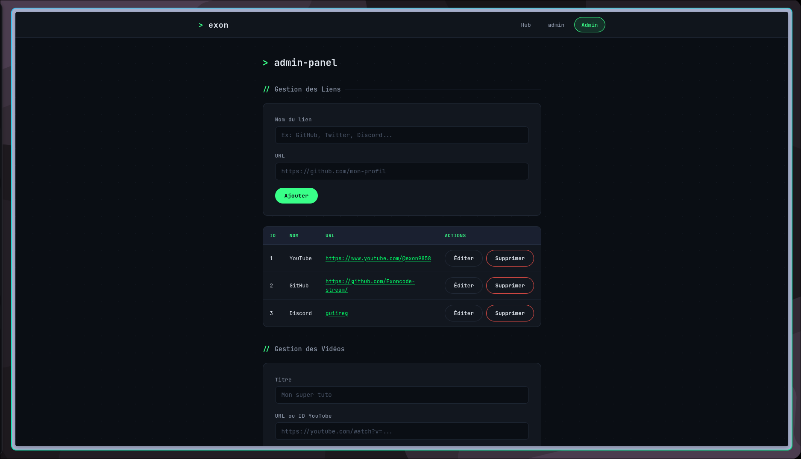
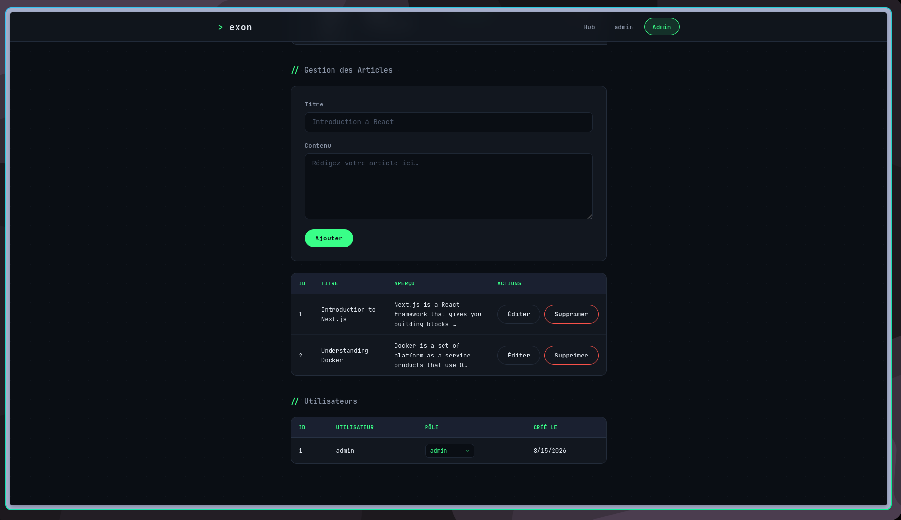
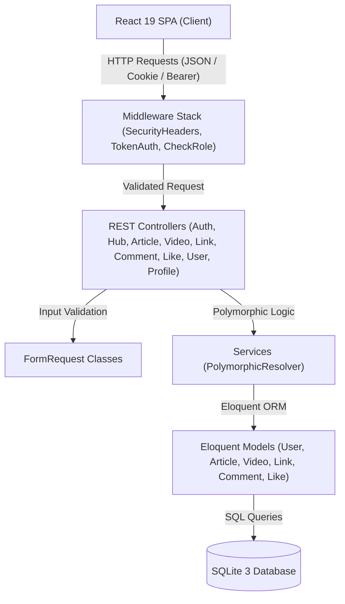

# Exon — Full-Stack Community Hub

Exon is a full-stack community hub platform built for multimedia content aggregation, developer discussion, and role-based access control. It centralizes YouTube video feeds, Markdown tech articles, and external social links into a single reactive hub.

The system uses a decoupled architecture featuring a React 19 Single Page Application (SPA) frontend and a Laravel 12 RESTful API backend backed by an SQLite relational database.

---

## Visual Demonstration

Below are interface captures demonstrating the primary user flows across the Exon platform:

### 1. Home Hub Feed & Content Overview


### 2. User Authentication & Login Flow


### 3. User Profile & Account Space

*Shows user profile information (username, assigned role, registration date, created comments count, liked contents count), password update form, logout option, hub return shortcut, and administrator panel access button.*

### 4. Staff Admin Panel — Links & Videos Management

*First section of the staff administration panel showing external social link management (GitHub, Twitter, Discord...) and YouTube video entry CRUD management.*

### 5. Staff Admin Panel — Articles & User Role Management

*Second section of the staff administration panel showing Markdown article CRUD management and user administration with user ID, username, assigned role, and creation date.*

---

## Metadata and Access

* **Project Status**: Active Development
* **Repository**: [https://github.com/Exoncode-stream/Exon.git](https://github.com/Exoncode-stream/Exon.git)
* **Frontend SPA URL**: `http://localhost:8081` (Docker) or `http://localhost:5173` (Vite dev)
* **Backend REST API URL**: `http://localhost:8000/api`
* **Default Seeder Credentials**:
  * **Username**: `admin`
  * **Password**: `admin`
  * **Role**: `admin`

---

## Core Features

* **Aggregated Multimedia Feed**: Centralized stream combining video cards, interactive article previews, and external link pills.
* **Real-time Toolbar Search**: Instant text filtering across title and body content alongside video category filters.
* **Markdown Reader**: HTML native modal dialog (`<dialog>`) parsing Markdown articles (`react-markdown`) with nested comment threads and like buttons.
* **Polymorphic Interactions**: Unified comments and upvote likes attached dynamically to either articles or videos.
* **Authentication and User Space**: Bearer token and HttpOnly cookie sessions, profile page showing personal engagement statistics (comments count, likes count), and secure password update.
* **Role-Based Staff Dashboard**: Administration panel for creating, editing, and deleting links, videos, and articles, as well as managing user role escalations with anti-lockout protection.

---

## Tech Stack and Justifications

### Frontend
* **React 19**: Provides component encapsulation, reactive UI state management, and optimized render performance.
* **Vite 6**: Next-generation frontend build tooling offering instant Hot Module Replacement (HMR) and optimized production bundling.
* **React Router DOM v7**: Client-side routing with navigation state management and `ProtectedRoute` access guards.
* **React Markdown v10**: Lightweight Markdown parser for rendering structured tech articles directly inside the reader modal.
* **Vanilla CSS**: Custom modular design system (`src/styles/` divided into `base/`, `components/`, `pages/`) providing visual control without utility framework bloat.
* **Vitest 4 & React Testing Library**: Fast test execution unit and component testing suite mimicking real DOM interactions.

### Backend
* **PHP 8.3 (Docker) / PHP 8.2+ (Local)**: Modern PHP engine delivering performance and strict typing support.
* **Laravel 12**: PHP web framework providing REST routing, Eloquent ORM, custom authentication middleware, and input validation.
* **SQLite 3**: Lightweight, zero-configuration relational database engine ideal for fast local execution and containerized test isolation.
* **PHPUnit 11**: Feature test framework validating backend route behavior, database constraints, and RBAC policies.

### Infrastructure & Operations
* **Docker & Docker Compose**: Containerized multi-service runtime ensuring parity between local development and deployment environments (Nginx frontend, Apache backend).
* **Laravel Pint**: Opinionated PHP code style fixer ensuring code formatting standards.

---

## System Architecture

### Data Flow



### Architectural Decisions

1. **Decoupled SPA and REST API**: Separating the React client from the Laravel backend enables independent deployment, API reusability, and decoupled frontend/backend testing.
2. **Custom SHA-256 Bearer & HttpOnly Cookie Auth**: Tokens are passed via Bearer authorization header or HttpOnly cookie (`exon_token`), preventing XSS token theft. Only SHA-256 token hashes are stored in the database to mitigate data leak exposure.
3. **Polymorphic Interaction Engine**: Comments and likes use Eloquent polymorphic morphs (`commentable` and `likeable` morph types). A single controller and model set handles interactions for both articles and videos, eliminating redundant tables.
4. **RBAC with Anti-Lockout Defense**: Four distinct permission tiers (`viewer`, `sub`, `moderator`, `admin`). The user management service explicitly checks and prevents demoting or deleting the final remaining administrator account.
5. **FormRequest Validation**: All mutation requests are sanitized and validated in dedicated Request classes prior to controller execution, maintaining clean controller actions.
6. **Standardized API Response Contract**: Every API endpoint returns predictable JSON structures wrapping primary domain keys (`user`, `articles`, `videos`, `links`, `comments`, `message`), ensuring frontend data fetching consistency.

---

## Quickstart

### Prerequisites

* **Git**: `2.x+`
* **Node.js**: `20.x` or higher
* **npm**: `10.x` or higher
* **PHP**: `8.2` or `8.3` (with `pdo_sqlite` extension enabled)
* **Composer**: `2.x+`
* **Docker & Docker Compose**: (Optional, for containerized execution)

---

### Environment Variables

Backend environment configuration is defined in `backend/` via Laravel configuration settings or runtime environment variables:

| Variable | Description | Required | Default Value |
| :--- | :--- | :--- | :--- |
| `APP_ENV` | Application environment state (`local`, `testing`, `production`) | Yes | `local` |
| `APP_DEBUG` | Enables detailed debugging and exception trace output | Yes | `true` |
| `APP_KEY` | 32-character encryption key for session security | Yes | Pre-generated in Docker |
| `DB_CONNECTION` | Database driver specification | Yes | `sqlite` |
| `DB_DATABASE` | Absolute file path or memory identifier for SQLite database | Yes | `/var/www/html/database/database.sqlite` |

---

### Installation & Local Setup

#### Option A: Docker Compose (Recommended)

1. Clone the repository:
   ```bash
   git clone https://github.com/Exoncode-stream/Exon.git
   cd Exon
   ```

2. Launch container stack:
   ```bash
   docker compose up --build
   ```
   *The container startup script automatically installs Composer dependencies, creates the SQLite database file, applies migrations, and runs initial seeders.*

3. Access endpoints:
   * Frontend Application: `http://localhost:8081`
   * Backend REST API: `http://localhost:8000/api/hub`

---

#### Option B: Manual Local Setup

1. **Backend Setup**:
   ```bash
   cd backend
   composer install
   touch database/database.sqlite
   php artisan migrate --seed
   php artisan serve --port=8000
   ```

2. **Frontend Setup**:
   ```bash
   cd frontend
   npm install
   npm run dev
   ```

---

## Testing and Code Quality

### Backend Test Suite (PHPUnit)

The backend features 48 automated tests covering feature routes, authentication mechanisms, polymorphic models, and RBAC authorization policies.

Run backend tests locally:
```bash
cd backend
./vendor/bin/phpunit
```

Run backend tests via Docker Compose:
```bash
docker compose --profile test up backend-test
```

### Frontend Test Suite (Vitest)

The frontend test suite includes 8 component and context tests evaluating session authentication, modal interactions, navigation, and card rendering.

Run frontend tests:
```bash
cd frontend
npm run test
```

### Code Formatting and Linting

PHP code formatting is enforced using Laravel Pint:
```bash
cd backend
./vendor/bin/pint
```

### Continuous Integration (CI/CD)

*Note: No automated GitHub Actions workflow or external CI/CD pipeline is currently configured in this repository.*

---

## REST API Reference

| Method | Endpoint | Description | Auth Required | Minimum Role |
| :--- | :--- | :--- | :--- | :--- |
| `POST` | `/api/login` | Authenticate user and issue session token/cookie | No | Public |
| `POST` | `/api/register` | Register new account (default role: `viewer`) | No | Public |
| `GET` | `/api/hub` | Aggregated feed payload (articles, videos, links) | No | Public |
| `GET` | `/api/links` | List external social links | No | Public |
| `GET` | `/api/videos` | List published YouTube videos | No | Public |
| `GET` | `/api/articles` | List published Markdown articles | No | Public |
| `GET` | `/api/{type}/{id}/comments` | List comments for an article or video | No | Public |
| `GET` | `/api/verify-token` | Verify active session and return user profile | Yes | Authenticated |
| `POST` | `/api/logout` | Revoke current token and clear authentication cookie | Yes | Authenticated |
| `GET` | `/api/profile` | Fetch user profile and engagement statistics | Yes | Authenticated |
| `PUT` | `/api/profile/password` | Update authenticated user password | Yes | Authenticated |
| `POST` | `/api/{type}/{id}/comments` | Post a comment under an article or video | Yes | `sub` |
| `DELETE`| `/api/comments/{comment}` | Delete a comment | Yes | Author / Moderator |
| `POST` | `/api/{type}/{id}/like` | Toggle like upvote on an article or video | Yes | `sub` |
| `POST` | `/api/links` | Create a new external link | Yes | `moderator` |
| `PUT` | `/api/links/{link}` | Update an existing external link | Yes | `moderator` |
| `DELETE`| `/api/links/{link}` | Delete an external link | Yes | `moderator` |
| `POST` | `/api/videos` | Create a new video entry | Yes | `moderator` |
| `PUT` | `/api/videos/{video}` | Update a video entry | Yes | `moderator` |
| `DELETE`| `/api/videos/{video}` | Delete a video entry | Yes | `moderator` |
| `POST` | `/api/articles` | Create a new Markdown article | Yes | `moderator` |
| `PUT` | `/api/articles/{article}` | Update an existing article | Yes | `moderator` |
| `DELETE`| `/api/articles/{article}` | Delete an article | Yes | `moderator` |
| `GET` | `/api/users` | List registered application users | Yes | `admin` |
| `PUT` | `/api/users/{id}/role` | Update user authorization role | Yes | `admin` |

---

## Security & Performance

### Implemented Security Controls

* **Token Hashing**: Tokens generated upon authentication are hashed using SHA-256 before database persistence. Raw tokens are never stored.
* **HttpOnly Cookie Security**: Session tokens are attached as `exon_token` HttpOnly cookies to defend against client-side script token theft.
* **Security Headers**: Middleware automatically sets `X-Frame-Options: DENY`, `X-Content-Type-Options: nosniff`, `X-XSS-Protection`, and `Referrer-Policy: no-referrer-when-downgrade`.
* **Rate Limiting**: Critical endpoints (`/api/login`, `/api/register`, `/api/profile/password`) enforce route throttling to prevent brute-force attacks.
* **Anti-Lockout RBAC**: Role modification logic enforces that at least one active administrator remains system-wide.

### Performance Optimizations

* **SQLite Embedded Storage**: High-speed, zero-network-latency database operations suitable for community hub query volume.
* **Single-Query Feed Aggregation**: `/api/hub` gathers links, videos, and articles in one concurrent backend request cycle to reduce client-side network roundtrips.
* **Lightweight Bundle**: SPA asset size remains minimized by avoiding bulky third-party UI framework dependencies in favor of modular Vanilla CSS.

---

## Prospective Roadmap

* [ ] Add GitHub Actions CI workflow to execute PHPUnit, Vitest, and Pint checks on pull requests.
* [ ] Implement End-to-End (E2E) UI testing using Playwright or Cypress.
* [ ] Introduce refresh token rotation and active session management view in profile settings.
* [ ] Implement pagination and dynamic scroll loading for article feeds.
